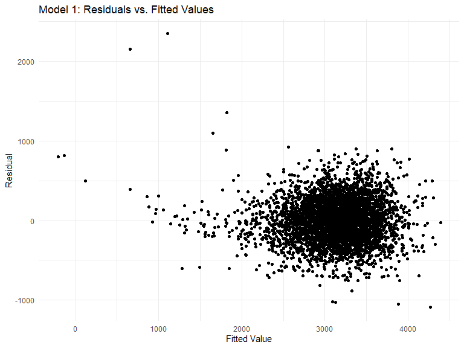
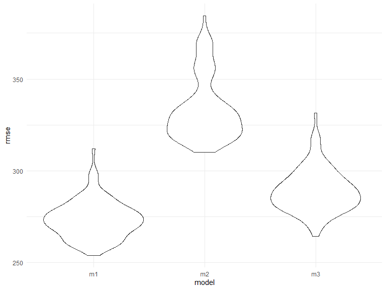

p8105\_hw6\_kk3154
================
Kristen King

## Problem 1 - Linear Regression Model for Birthweight

Loading and cleaning the birthweight data.

``` r
bw_df = read_csv(file = "./data/birthweight.csv", show_col_types = FALSE)

bw_df = bw_df %>% 
  mutate(
    babysex = factor(babysex, levels = c(1, 2), labels = c("male", "female")), 
    frace = factor(frace, levels = c(1, 2, 3, 4, 8, 9), labels = c("White", "Black", "Asian", "Puerto Rican", "Other", "Unknown")),
    malform = factor(malform, levels = c(0, 1), labels = c("absent", "present")), 
    mrace = factor(mrace, levels = c(1, 2, 3, 4, 8), labels = c("White", "Black", "Asian", "Puerto Rican", "Other")) 
  )

skimr::skim(bw_df)
```

|                                                  |        |
|:-------------------------------------------------|:-------|
| Name                                             | bw\_df |
| Number of rows                                   | 4342   |
| Number of columns                                | 20     |
| \_\_\_\_\_\_\_\_\_\_\_\_\_\_\_\_\_\_\_\_\_\_\_   |        |
| Column type frequency:                           |        |
| factor                                           | 4      |
| numeric                                          | 16     |
| \_\_\_\_\_\_\_\_\_\_\_\_\_\_\_\_\_\_\_\_\_\_\_\_ |        |
| Group variables                                  | None   |

Data summary

**Variable type: factor**

| skim\_variable | n\_missing | complete\_rate | ordered | n\_unique | top\_counts                             |
|:---------------|-----------:|---------------:|:--------|----------:|:----------------------------------------|
| babysex        |          0 |              1 | FALSE   |         2 | mal: 2230, fem: 2112                    |
| frace          |          0 |              1 | FALSE   |         5 | Whi: 2123, Bla: 1911, Pue: 248, Asi: 46 |
| malform        |          0 |              1 | FALSE   |         2 | abs: 4327, pre: 15                      |
| mrace          |          0 |              1 | FALSE   |         4 | Whi: 2147, Bla: 1909, Pue: 243, Asi: 43 |

**Variable type: numeric**

| skim\_variable | n\_missing | complete\_rate |    mean |     sd |     p0 |     p25 |     p50 |     p75 |   p100 | hist  |
|:---------------|-----------:|---------------:|--------:|-------:|-------:|--------:|--------:|--------:|-------:|:------|
| bhead          |          0 |              1 |   33.65 |   1.62 |  21.00 |   33.00 |   34.00 |   35.00 |   41.0 | ▁▁▆▇▁ |
| blength        |          0 |              1 |   49.75 |   2.72 |  20.00 |   48.00 |   50.00 |   51.00 |   63.0 | ▁▁▁▇▁ |
| bwt            |          0 |              1 | 3114.40 | 512.15 | 595.00 | 2807.00 | 3132.50 | 3459.00 | 4791.0 | ▁▁▇▇▁ |
| delwt          |          0 |              1 |  145.57 |  22.21 |  86.00 |  131.00 |  143.00 |  157.00 |  334.0 | ▅▇▁▁▁ |
| fincome        |          0 |              1 |   44.11 |  25.98 |   0.00 |   25.00 |   35.00 |   65.00 |   96.0 | ▃▇▅▂▃ |
| gaweeks        |          0 |              1 |   39.43 |   3.15 |  17.70 |   38.30 |   39.90 |   41.10 |   51.3 | ▁▁▂▇▁ |
| menarche       |          0 |              1 |   12.51 |   1.48 |   0.00 |   12.00 |   12.00 |   13.00 |   19.0 | ▁▁▂▇▁ |
| mheight        |          0 |              1 |   63.49 |   2.66 |  48.00 |   62.00 |   63.00 |   65.00 |   77.0 | ▁▁▇▂▁ |
| momage         |          0 |              1 |   20.30 |   3.88 |  12.00 |   18.00 |   20.00 |   22.00 |   44.0 | ▅▇▂▁▁ |
| parity         |          0 |              1 |    0.00 |   0.10 |   0.00 |    0.00 |    0.00 |    0.00 |    6.0 | ▇▁▁▁▁ |
| pnumlbw        |          0 |              1 |    0.00 |   0.00 |   0.00 |    0.00 |    0.00 |    0.00 |    0.0 | ▁▁▇▁▁ |
| pnumsga        |          0 |              1 |    0.00 |   0.00 |   0.00 |    0.00 |    0.00 |    0.00 |    0.0 | ▁▁▇▁▁ |
| ppbmi          |          0 |              1 |   21.57 |   3.18 |  13.07 |   19.53 |   21.03 |   22.91 |   46.1 | ▃▇▁▁▁ |
| ppwt           |          0 |              1 |  123.49 |  20.16 |  70.00 |  110.00 |  120.00 |  134.00 |  287.0 | ▅▇▁▁▁ |
| smoken         |          0 |              1 |    4.15 |   7.41 |   0.00 |    0.00 |    0.00 |    5.00 |   60.0 | ▇▁▁▁▁ |
| wtgain         |          0 |              1 |   22.08 |  10.94 | -46.00 |   15.00 |   22.00 |   28.00 |   89.0 | ▁▁▇▁▁ |

Building a linear model (Model 1).

Identifying variables for inclusion by running all bivariable
(unadjusted) models and removing variables with a p-value &gt; 0.1 (for
categorical variables, remove only if p &gt; 0.1 for all levels).

``` r
predictors = colnames(select(bw_df, -bwt))

unadj_function = function(preds) {
  form = paste("bwt ~", preds)
  lm(as.formula(form), data = bw_df)
}

unadj_models = tibble(
  names = predictors, 
  models = map(predictors, unadj_function), 
  results = map(models, broom::tidy)) %>% 
  select(names, results) %>% 
  unnest(results) %>% 
  filter(term != "(Intercept)") %>% 
  knitr::kable(digits = 3)

unadj_models
```

| names    | term              | estimate | std.error | statistic | p.value |
|:---------|:------------------|---------:|----------:|----------:|--------:|
| babysex  | babysexfemale     |  -88.770 |    15.494 |    -5.729 |   0.000 |
| bhead    | bhead             |  236.109 |     3.189 |    74.046 |   0.000 |
| blength  | blength           |  139.811 |     1.909 |    73.233 |   0.000 |
| delwt    | delwt             |    6.639 |     0.335 |    19.804 |   0.000 |
| fincome  | fincome           |    3.048 |     0.296 |    10.307 |   0.000 |
| frace    | fraceBlack        | -313.731 |    15.432 |   -20.329 |   0.000 |
| frace    | fraceAsian        | -105.796 |    72.937 |    -1.451 |   0.147 |
| frace    | fracePuerto Rican | -203.898 |    32.842 |    -6.208 |   0.000 |
| frace    | fraceOther        |  -88.536 |   131.230 |    -0.675 |   0.500 |
| gaweeks  | gaweeks           |   66.920 |     2.245 |    29.804 |   0.000 |
| malform  | malformpresent    |   11.636 |   132.482 |     0.088 |   0.930 |
| menarche | menarche          |   -8.465 |     5.260 |    -1.610 |   0.108 |
| mheight  | mheight           |   37.048 |     2.872 |    12.900 |   0.000 |
| momage   | momage            |   17.932 |     1.986 |     9.028 |   0.000 |
| mrace    | mraceBlack        | -316.564 |    15.377 |   -20.587 |   0.000 |
| mrace    | mraceAsian        | -126.430 |    75.284 |    -1.679 |   0.093 |
| mrace    | mracePuerto Rican | -211.321 |    33.084 |    -6.387 |   0.000 |
| parity   | parity            |  -41.674 |    75.538 |    -0.552 |   0.581 |
| pnumlbw  | pnumlbw           |       NA |        NA |        NA |      NA |
| pnumsga  | pnumsga           |       NA |        NA |        NA |      NA |
| ppbmi    | ppbmi             |   15.120 |     2.432 |     6.217 |   0.000 |
| ppwt     | ppwt              |    4.646 |     0.379 |    12.255 |   0.000 |
| smoken   | smoken            |   -5.229 |     1.046 |    -4.997 |   0.000 |
| wtgain   | wtgain            |   11.570 |     0.688 |    16.811 |   0.000 |

Model 1 will include all predictor variables in the dataset, except for
malform, menarche, parity, pnumlbw, and pnumsga based on bivariable
analyses. I will also exclude ppwt and mheight since these are
presumably already incorporated in the calculation of ppbmi.

``` r
fit_m1 = lm(bwt ~ babysex + bhead + blength + delwt + fincome + frace + gaweeks + momage + mrace + ppbmi + smoken + wtgain, data = bw_df) 

fit_m1 %>% 
  broom::tidy() %>% 
  knitr::kable(digits = 3)
```

| term              |  estimate | std.error | statistic | p.value |
|:------------------|----------:|----------:|----------:|--------:|
| (Intercept)       | -5685.783 |   103.106 |   -55.145 |   0.000 |
| babysexfemale     |    29.281 |     8.464 |     3.459 |   0.001 |
| bhead             |   130.947 |     3.451 |    37.942 |   0.000 |
| blength           |    74.971 |     2.021 |    37.088 |   0.000 |
| delwt             |     3.005 |     0.414 |     7.263 |   0.000 |
| fincome           |     0.292 |     0.179 |     1.628 |   0.104 |
| fraceBlack        |    13.368 |    46.154 |     0.290 |   0.772 |
| fraceAsian        |    19.172 |    69.319 |     0.277 |   0.782 |
| fracePuerto Rican |   -49.571 |    44.671 |    -1.110 |   0.267 |
| fraceOther        |     4.024 |    74.098 |     0.054 |   0.957 |
| gaweeks           |    11.251 |     1.461 |     7.701 |   0.000 |
| momage            |     0.711 |     1.197 |     0.594 |   0.552 |
| mraceBlack        |  -151.010 |    46.060 |    -3.279 |   0.001 |
| mraceAsian        |   -95.500 |    71.911 |    -1.328 |   0.184 |
| mracePuerto Rican |   -56.740 |    45.141 |    -1.257 |   0.209 |
| ppbmi             |    -9.110 |     2.581 |    -3.530 |   0.000 |
| smoken            |    -4.876 |     0.587 |    -8.307 |   0.000 |
| wtgain            |     1.147 |     0.573 |     2.003 |   0.045 |

Plotting residuals against fitted values for Model 1:

``` r
bw_df %>% 
  modelr::add_residuals(fit_m1) %>% 
  modelr::add_predictions(fit_m1) %>% 
  ggplot(aes(x = pred, y = resid)) + 
  geom_point() + 
  labs(
    title = "Model 1: Residuals vs. Fitted Values", 
    y = "Residual",
    x = "Fitted Value")
```



Comparing Model 1 to two additional models using cross-validation.

-   Model 2: Main Effects only (length at birth and gestational age)

-   Model 3: Interaction model (head circumference, length, sex + 3-way
    interaction)

``` r
library(modelr)
library(purrr)

cv_df = 
  crossv_mc(bw_df, 100, test = .2, id = ".id") %>% 
  mutate(
    train = map(train, as_tibble),
    test = map(test, as_tibble)
  )

cv_df2 = 
  cv_df %>% 
  mutate(
    m1 = map(.x = train, ~lm(bwt ~ babysex + bhead + blength + delwt + fincome + frace + gaweeks + momage + mrace + ppbmi + smoken + wtgain, data = .x)), 
    m2 = map(.x = train, ~lm(bwt ~ blength + gaweeks, data = .x)), 
    m3 = map(.x = train, ~lm(bwt ~ bhead * blength * babysex, data = .x))
  ) %>% 
  mutate(
    rmse_m1 = map2_dbl(.x = m1, .y = test, ~rmse(model = .x, data = .y)), 
    rmse_m2 = map2_dbl(.x = m2, .y = test, ~rmse(model = .x, data = .y)),
    rmse_m3 = map2_dbl(.x = m3, .y = test, ~rmse(model = .x, data = .y)),
  )

cv_df2 %>% 
  select(.id, starts_with("rmse")) %>% 
  pivot_longer(
    rmse_m1:rmse_m3,
    names_to = "model", 
    values_to = "rmse",
    names_prefix = "rmse_"
  ) %>% 
  ggplot(aes(x = model, y = rmse)) + 
  geom_violin()
```



## Problem 2 - Bootstrapping Central Park Weather Data

Loading 2017 Central Park weather data.

``` r
weather_df = 
  rnoaa::meteo_pull_monitors(
    c("USW00094728"),
    var = c("PRCP", "TMIN", "TMAX"), 
    date_min = "2017-01-01",
    date_max = "2017-12-31") %>%
  mutate(
    name = recode(id, USW00094728 = "CentralPark_NY"),
    tmin = tmin / 10,
    tmax = tmax / 10) %>%
  select(name, id, everything())
```

    ## Registered S3 method overwritten by 'hoardr':
    ##   method           from
    ##   print.cache_info httr

    ## using cached file: C:\Users\Kristen\AppData\Local/Cache/R/noaa_ghcnd/USW00094728.dly

    ## date created (size, mb): 2021-12-04 00:44:55 (7.631)

    ## file min/max dates: 1869-01-01 / 2021-12-31
